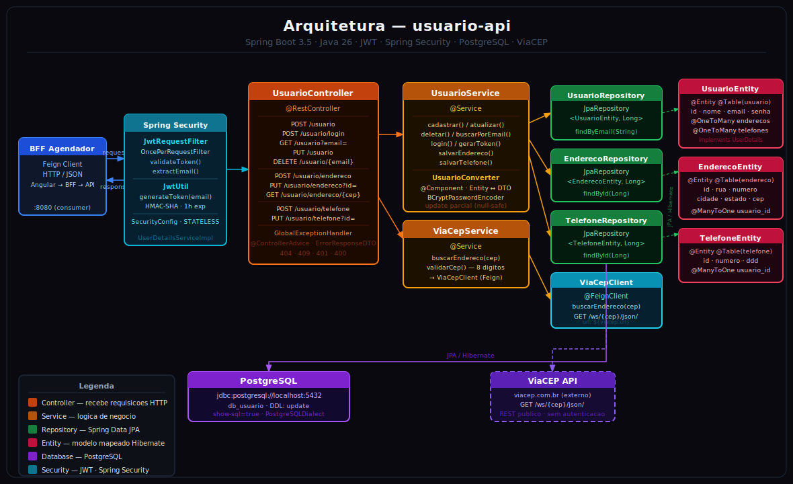

# Arquitetura Geral

## Diagrama



## Ecossistema: BFF Agendador de Tarefas

A `usuario-api` é um **microserviço** dentro de um sistema maior. Ela nunca é chamada diretamente pelo front-end — toda comunicação passa pelo **BFF (Backend for Frontend)**.

```text
┌─────────────────────────────────────────────────────────────────────┐
│                        Ecossistema                                  │
│                                                                     │
│  ┌──────────────┐   HTTP/REST   ┌──────────────────────────────┐    │
│  │  Angular SPA │──────────────►│   BFF Agendador de Tarefas   │    │
│  │   (:4200)    │               │  BffController               │    │
│  └──────────────┘               │  UsuarioController           │    │
│                                 │  BffService / UsuarioService │    │
│                                 │  Feign Client                │    │
│                                 │  SecurityConfig              │    │
│                                 └──────────┬───────────────────┘    │
│                                            │ Feign Client (HTTP)    │
│                        ┌───────────────────┼────────────────────┐   │
│                        │                   │                    │   │
│               ┌────────▼──────┐  ┌─────────▼──────┐  ┌────────▼─┐ │
│               │  usuario-api  │  │   agendador     │  │notificacao│ │
│               │   (:8080)     │  │   (:8090)       │  │          │ │
│               │  ► este svc   │  │                 │  │          │ │
│               └───────┬───────┘  └────────┬────────┘  └────┬────┘ │
│                        │                   │                │      │
│               ┌────────▼──────┐  ┌─────────▼──────┐  ┌────▼────┐  │
│               │  PostgreSQL   │  │    MongoDB      │  │ ViaCEP  │  │
│               │   (:5432)     │  │   (:27017)      │  │(externo)│  │
│               └───────────────┘  └─────────────────┘  └─────────┘  │
└─────────────────────────────────────────────────────────────────────┘
```

### Responsabilidades de cada serviço

| Serviço | Responsabilidade | Banco |
| --- | --- | --- |
| **BFF Agendador de Tarefas** | Orquestra chamadas, autenticação, roteamento | — |
| **usuario-api** | CRUD de usuários, endereços, telefones, auth JWT | PostgreSQL |
| **agendador** | Agendamento de tarefas | MongoDB |
| **notificacao** | Envio de notificações, consulta de CEP | ViaCEP (externo) |

### Como o BFF consome esta API

O BFF usa **Spring Cloud OpenFeign** para comunicar com a `usuario-api`. Ele:

1. Recebe a requisição do Angular com JWT no header
2. Repassa o token via `Authorization: Bearer <token>` para a `usuario-api`
3. Retorna a resposta ao Angular

---

## Arquitetura interna da usuario-api

A `usuario-api` segue uma **Layered Architecture** com separação explícita entre apresentação, negócio e infraestrutura.

```text
┌──────────────────────────────────────────────────────┐
│            BFF Agendador de Tarefas                  │
│           (Feign Client → :8080)                     │
└────────────────────┬─────────────────────────────────┘
                     │ HTTP/REST
┌────────────────────▼─────────────────────────────────┐
│            Spring Security (JWT Filter)               │
└────────────────────┬─────────────────────────────────┘
                     │
┌────────────────────▼─────────────────────────────────┐
│                Controller Layer                       │
│             (UsuarioController)                       │
└────────────────────┬─────────────────────────────────┘
                     │
┌────────────────────▼─────────────────────────────────┐
│                Business Layer                         │
│         (UsuarioService, ViaCepService)               │
└──────────┬──────────────────────────┬────────────────┘
           │                          │
┌──────────▼──────────┐   ┌───────────▼──────────────┐
│  Repository Layer   │   │    External Clients        │
│  (JPA Repositories) │   │  (ViaCEP via Feign)        │
└──────────┬──────────┘   └──────────────────────────┘
           │
┌──────────▼──────────┐
│     PostgreSQL       │
│      (:5432)         │
└─────────────────────┘
```

## Camadas internas

### Controller

- Única classe: `UsuarioController`
- Recebe requisições do BFF, valida entrada e devolve respostas
- Não contém lógica de negócio — delega ao serviço

### Business (Service)

- `UsuarioService` — CRUD de usuários, endereços e telefones; geração e validação de JWT
- `ViaCepService` — validação de CEP e chamada ao cliente Feign externo

### Infrastructure

| Subpacote | Responsabilidade |
| --- | --- |
| `entity` | Entidades JPA mapeadas para o banco |
| `repository` | Interfaces Spring Data JPA |
| `security` | JWT, filtros, UserDetailsService, SecurityConfig |
| `clients` | Feign client para ViaCEP |
| `exceptions` | Hierarquia de exceções e `@ControllerAdvice` global |

## Fluxo de uma requisição protegida (BFF → usuario-api)

```text
1. Angular envia request ao BFF com JWT no header
2. BFF usa Feign Client: GET /usuario?email=X + Authorization: Bearer <token>
3. JwtRequestFilter na usuario-api intercepta a request
4. JwtUtil valida e extrai o e-mail do token
5. UserDetailsServiceImpl carrega o usuário do banco
6. SecurityContextHolder é populado
7. DispatcherServlet encaminha para UsuarioController
8. Controller chama UsuarioService
9. UsuarioService acessa Repository (PostgreSQL) e/ou ViaCepService
10. Resposta retorna ao BFF → BFF retorna ao Angular
```

## Fluxo de autenticação (login via BFF)

```text
1. Angular envia credenciais ao BFF
2. BFF chama POST /usuario/login { email, senha } na usuario-api
3. UsuarioService busca usuário por email no PostgreSQL
4. BCryptPasswordEncoder valida a senha
5. JwtUtil gera token com expiração de 1 hora
6. Token retornado ao BFF
7. BFF repassa o token ao Angular
```

## Tratamento de erros

Todas as exceções são capturadas pelo `GlobalExceptionHandler` (`@ControllerAdvice`) que retorna um `ErrorResponseDTO` padronizado ao BFF:

```json
{
  "timestamp": "2026-04-28T12:00:00",
  "status": 404,
  "error": "Not Found",
  "message": "Usuário não encontrado",
  "path": "/usuario"
}
```

| Exceção | HTTP Status |
| --- | --- |
| `ResourceNotFoundException` | 404 |
| `ConflictException` | 409 |
| `UnauthorizedException` | 401 |
| `IllegalArgumentException` | 400 |

## Tecnologias-chave

- **Spring Boot 3.5** — auto-configuração e gestão de ciclo de vida
- **Spring Data JPA** — abstração sobre Hibernate/PostgreSQL
- **Spring Security** — filtro JWT e configuração de rotas públicas/protegidas
- **Spring Cloud OpenFeign** — cliente HTTP declarativo para ViaCEP
- **Lombok** — redução de boilerplate (getters, setters, builders)
- **Springdoc OpenAPI 2.8** — geração automática de Swagger UI
